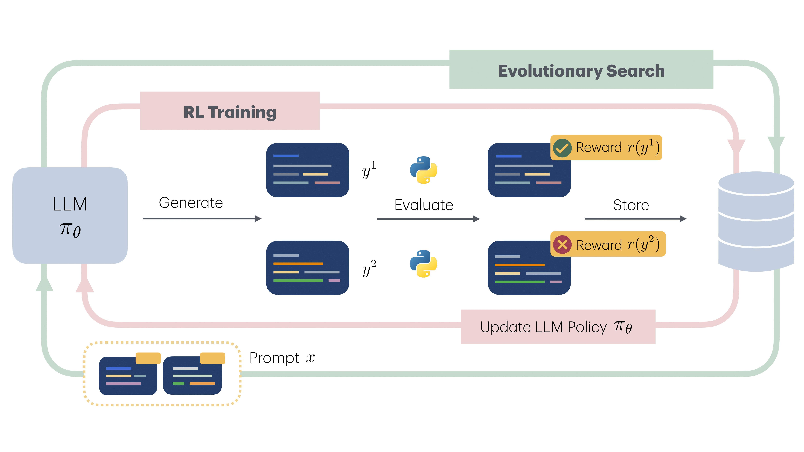

# Algorithm Discovery With LLMs: Evolutionary Search Meets Reinforcement Learning

<!--  -->

[](https://arxiv.org/abs/2504.05108)
[](./LICENSE)


## Overview

**EvoTune** is a framework for discovering new algorithms by combining:

1. Evolutionary search over LLM-generated Python programs, and
2. Reinforcement Learning to fine-tune the search operator - the LLM - based on performance scores of discovered algorithms .


## Repo Structure

The core codebase lives under ```src/``` and is organized as follows:

```plaintext

evotune/
├── configs/                  # Hydra-based config system
│   ├── accelerate_config/    # Accelerate configs
│   ├── cluster/              # SLURM / cluster overrides
│   ├── model/                # Model-specific settings
│   ├── sweep/                # Sweep configuration files
│   ├── task/                 # Per-task configs (e.g., bin, tsp, etc.)
│   ├── train/                # Training configuration
│   └── config.yaml           # Default config
├── data/                     # TSP and flatpack datasets
├── installation/             # Dockerfiles for various hardware
├── scripts/                  # Example launch scripts for sweeps
│   ├── run_eval_sweep_example.sh
│   └── run_train_sweep_example.sh
├── src/
|   ├── packing/              # Core EvoTune framework
|   │   ├── evaluate/         # Task-specific logic (registered via registry)
|   │   │   ├── bin_packing/
|   │   │   ├── flat_pack/
|   │   │   ├── tsp/
|   │   │   ├── registry.py   # Task registry
|   │   │   └── README.md     # How to add new tasks
|   │   ├── funsearch/        # Program database implementation
|   │   ├── logging/          # Logging, statistics, and function tracking
|   │   ├── model/            # Prompting, LLM I/O, inference engine setup
|   │   ├── parallel/         # Multiprocessing producers & consumers
|   │   ├── train/            # DPO pipelines for fine-tuning LLMs
|   │   └── utils/            # Seeding, function helpers, etc.
|   └──  experiments/         # Scripts for specific experiments (train / eval)
├── pyproject.toml
└── LICENSE
```


## Setup & Dependencies

To create the Python environment for running experiments, use one of the provided **Dockerfiles** that matches your machine architecture and desired inference backend:

```plaintext
installation/
├── docker-amd64-cuda-tgi/   # For x86_64 machines using TGI
├── docker-amd64-cuda-vllm/  # For x86_64 machines using vLLM
└── docker-arm64-cuda/       # For ARM64 machines using vLLM
```

> Most experiments for the paper were run using **A100 GPUs (80GB)**.


## How to Run the Code

### Single Runs

The two main entry points are located in:

```plaintext
src/experiments/
├── main.py   # For running training with evolution + finetuning
├── eval.py   # For evaluating saved programbanks
```

### Sweep Runs

We provide example sweep scripts in the ```scripts/``` folder:

```plaintext
scripts/
├── run_eval_sweep_example.sh
├── run_train_sweep_example.sh
```

These are designed to be used with job schedulers like SLURM or RunAI. To use them:

1. Fill in the ```# TODO``` block in each script with your cluster submission logic.
2. Configure the sweep/grid settings in the appropriate ```configs/sweep/``` and ```configs/cluster/``` YAML files.
3. Launch your sweep using the modified script.

> You can also run sweeps locally by adapting these scripts, just remove the SLURM logic.

### Notes 
As the project evolved, so did the code. We are open-sourcing the latest version as it is easier to work with after a round of refactoring and other minor updates (for example, improved extraction of functions from LLM outputs). These changes may introduce small discrepancies in the results. In the paper, the bin packing and traveling salesman problem results were generated with the TGI inference engine, whereas the Flatpack, Hash Code, and LLM-SR experiments used vLLM. We added vLLM support to simplify running the code on clusters with ARM64 architecture.


## Adding a New Task

To add your own task:

👉 Navigate to:

```src/packing/evaluate/README.md```

You’ll find instructions for implementing and registering a new task with following components:

- ```generate_input```
- ```evaluate_func```
- ```get_initial_func```
- ```system_prompt``` / ```append_prompt```


### Citation
```bibtex
@inproceedings{surina2025algorithm,
title={Algorithm Discovery With LLMs: Evolutionary Search Meets Reinforcement Learning},
author={Anja Surina and Amin Mansouri and Lars C.P.M. Quaedvlieg and Amal Seddas and Maryna Viazovska and Emmanuel Abbe and Caglar Gulcehre},
booktitle={Second Conference on Language Modeling},
year={2025},
}
```